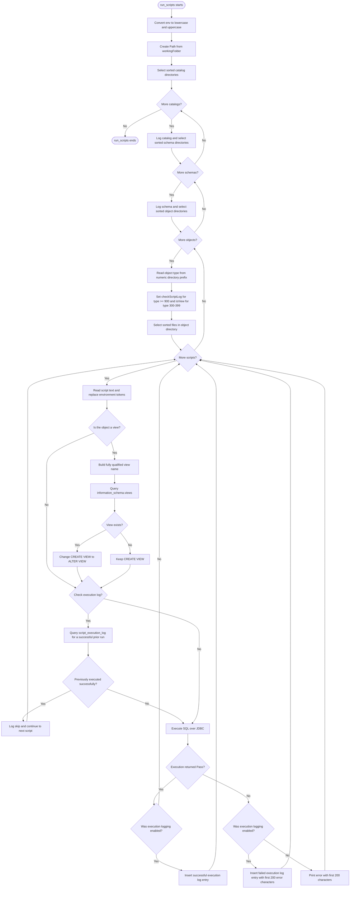

# SQL Deployment Utility

`deploy_sql.py` provides the `deploy_sql` class used to execute SQL files from the bundle's `schema` directory against Databricks over JDBC.

## Startup and configuration

When `deploy_sql` is instantiated, it:

1. Reads the `ENV` environment variable.
2. Loads `config/<ENV>-config.json` from the project root.
3. Reads the `envConfig` values for the environment name, Databricks URL, token, HTTP path, and host.
4. Stores those connection values on the instance for use by the deployment methods.

The module's `main()` method obtains `ENV` again, creates a `deploy_sql` instance, gets the Databricks host, HTTP path, and token, and calls `run_scripts()` with the `schema` directory as its working folder. The current `__main__` block uses a local absolute Windows path, so that path must be changed or made configurable when the utility runs elsewhere.

## JDBC execution

`invoke_sqlcmd_jdbc()` builds a Databricks JDBC URL and loads `drivers/databricks-jdbc-3.4.2.jar`. It opens a JDBC connection, executes one SQL command, closes the cursor and connection, and returns `"Pass"` on success. If execution fails, it returns the exception text instead of raising it.

`invoke_sqlcmd_jdbc_fetch()` follows the same connection pattern but fetches and returns the first result row. It is used for existence checks and for inserting deployment results into the execution log.

## `run_scripts()` behavior

The expected directory structure is:

```text
schema/
└── <catalog>/
    └── <schema>/
        └── <numbered object type>.<object name>/
            └── <SQL script files>
```

For example, the bundle contains object directories such as `100.schemas`, `200.tables`, `300.views`, and `900.scripts`. The function processes each level in sorted order:

1. It derives lowercase and uppercase forms of the supplied environment name.
2. It selects catalog directories under `workingFolder`. If `catalogFilter` is non-empty, only directory names containing that substring are selected.
3. For every selected catalog, it selects schema directories. `schemaFilter` is applied the same way.
4. It visits every object directory in sorted order and converts the numeric prefix before the first period to `objectType`.
5. It enables execution-log checking for object types `>= 900`. These are treated as rerunnable deployment scripts that should execute only once after a successful prior run.
6. It identifies views using the range `300 <= objectType < 400`.
7. For every file in an object directory, it reads the SQL and replaces these tokens:
   - `{env}` and `{envName}` with the lowercase environment name
   - `{envUpper}` and `{envNameUpper}` with the uppercase environment name
8. For a view, it derives the fully qualified view name from the script filename and queries `system.information_schema.views`. If the view exists, `create view` or `CREATE VIEW` is changed to `alter view` or `ALTER VIEW`; otherwise the command remains a create statement.
9. For `900+` objects, it queries `script_execution_log` by filename. A successful prior entry causes the script to be skipped. Otherwise, it executes the SQL and inserts either a NULL error or the first 200 characters of the error into the log.
10. For other object types, it executes the SQL without checking or writing the execution log. Failures are printed with their first 200 characters.

The function has no explicit return value. It continues processing later scripts after an execution failure because JDBC execution returns an error string rather than raising the exception.

## Execution flow



## Important assumptions

- Catalog and schema directory names are used as filesystem names; the function does not parse or validate their numeric prefixes.
- Every object directory name must begin with an integer followed by a period.
- View filenames must contain enough dot-separated parts for `parts[1]`, `parts[2]`, and `parts[3]` to form the target view name.
- SQL identifiers and error text are interpolated into SQL strings directly. The script assumes trusted filenames, configuration, and SQL content.
- The execution log table must already exist before `900+` scripts are processed.
